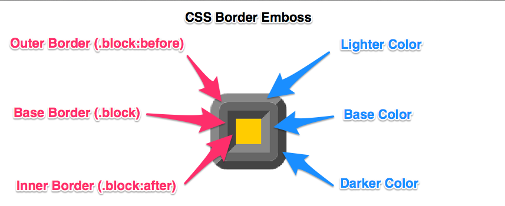

# CSS Embossed Border (SCSS mixin)


## How to use?
1. <code>@import "border-emboss";</code>
- <code>@include border-emboss();</code>

## Demo 
[Codepen Demo](http://codepen.io/Belyash/pen/JomEEe)

## Customize
<dl>
    <dt>$base</dt>
    <dd>Base color for border.</dd>
    <dt>$lighter</dt>
    <dd>Lighter color (patch of reflected light).</dd>
    <dt>$darker</dt>
    <dd>Darker color for side with shadow.</dd>
    <dt>$darkest</dt>
    <dd>The darkest color for side with shadow, if has been set then the shadow will be emulate as from vertical light(from top to bottom).</dd>
    <dt>$width</dt>
    <dd>Width of border (separately for darker, lighter and base color).</dd>
    <dt>$radius</dt>
    <dd>Border radius.</dd>
    <dt>$width2</dt>
    <dd>Width of outer side of border. If not set then equals $width.</dd>
    <dt>$width3</dt>
    <dd>Width of inner side of border. If not set then equals $width.</dd>
</dl>

## Examples
```
.default {
  @include border-emboss(#666, #888, #444);
}
.rounded {
  @include border-emboss(#666, #888, #444, $radius: 10px, $width: 10px);
}
.vertical {
  @include border-emboss(#666, #888, #444, #222, $width: 10px);
}
.circle {
  @include border-emboss(#666, #888, #444, $radius: 50px, $width: 10px);
}
```